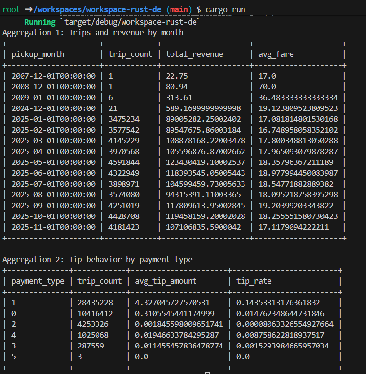

# NYC Yellow Taxi Data Aggregation (Rust + DataFusion)

This project analyzes **NYC Yellow Taxi trip data** using **Rust and Apache DataFusion**.  
The program reads Parquet files containing trip records and performs analytical aggregations to explore taxi usage, revenue trends, and tipping behavior.

---

## What the Project Does

- Loads NYC Yellow Taxi **Parquet trip data** using **Apache DataFusion** in Rust
- Computes **monthly trip and revenue statistics**
- Analyzes **tip behavior by payment method**
- Demonstrates **analytical queries over large datasets using Rust**

---

## Dataset Source

NYC Taxi & Limousine Commission (TLC) Trip Record Data

https://www.nyc.gov/site/tlc/about/tlc-trip-record-data.page

This dataset contains detailed records of taxi trips including:

- pickup and dropoff timestamps  
- trip distance  
- fare amount and total amount  
- payment type  
- tip amount  

---

## How to Download the Data

### Option 1 — Manual Download

1. Visit the dataset page:

    https://www.nyc.gov/site/tlc/about/tlc-trip-record-data.page

2. Download one or more **Yellow Taxi Trip Data (Parquet)** files.

    Example:
    yellow_tripdata_2025-01.parquet

3. Place the downloaded `.parquet` files into the project `data/` directory.
    project-root/
    │
    ├── data/
    │ ├── yellow_tripdata_2025-01.parquet
    │ ├── yellow_tripdata_2025-02.parquet
    | ├── etc.
    │
    ├── src/
    │ └── main.rs

---

### Option 2 — Download Using a Script (example)

Example using `wget`:

    `bash
    mkdir data
    cd data

    wget https://d37ci6vzurychx.cloudfront.net/trip-data/yellow_tripdata_2023-01.parquet'

You can download multiple months for larger analysis.

## How to Run the Project

    cargo run

The program will:
- Load all .parquet files inside the data/ directory
- Execute the analytical queries
- Print the results to the console

## Aggregations

### Aggregation 1: Trips and Revenue by Month

- Groups taxi trips by pickup month (derived from tpep_pickup_datetime) and computes:
- Trip Count — total number of taxi trips in the month
- Total Revenue — sum of total_amount
- Average Fare — average value of fare_amount

This aggregation helps identify seasonal demand and revenue patterns.

### Aggregation 2: Tip Behavior by Payment Type

- Groups trips by payment_type and computes:
- Trip Count — number of trips for each payment method
- Average Tip Amount — mean value of tip_amount
- Tip Rate — total tips divided by total fare revenue

This analysis shows how tipping varies between payment methods (cash vs card).

